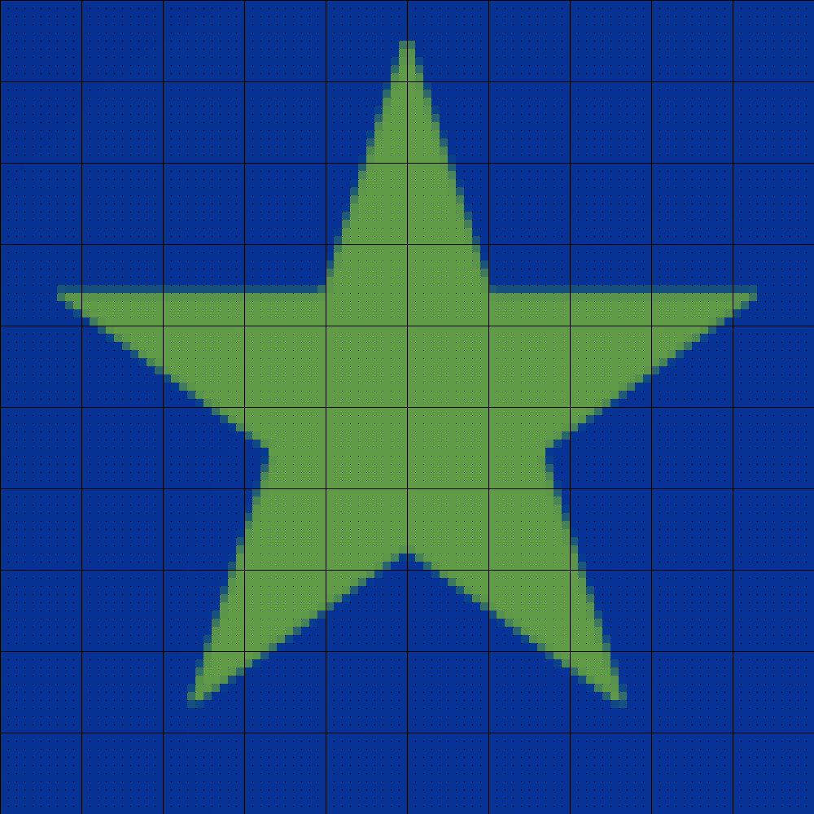
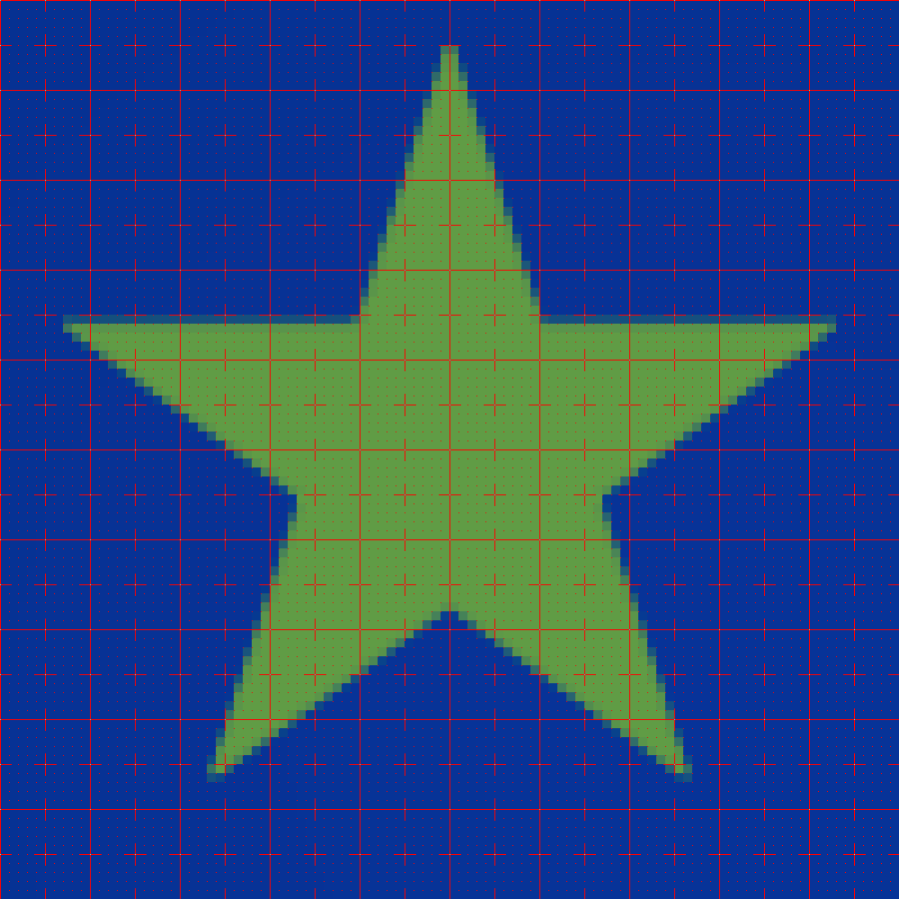

# Simple Pixel Art to Cross Stitch Pattern Script

## What does this do?

Making Cross stitch or similar patterns using pixel art is a very handy way to reduce images, but
its much easier to handle the final designs if there are some guide lines added outlining the pixels, and showing the position of every 5th or 10th pixel.
This script upscales an image to have more pixels, and adds guide lines at specified spacings.

## Dependencies?

Python Image Library (PIL) or Pillow (pip install PIL)
That's all!

## How to use this script

Once you have the PIL library, all the script needs is a filename to adapt. These can be png, gif, jpg etc.
The script can be run either as `python3 PixelArtToPattern.py` or `./PixelArtToPattern.py`

The result is a file with '\_chart' added to the name.
By default, the image is scaled up 10 times (each input pixel becomes a 10x10 square)
and a commonly useful set of guides added - black dots at the corners of every original pixel
and thin black lines outlining every 10x10 original square.

### Customisation

More guides can be added, images can be made bigger (guides smaller and thinner)
or smaller (guides larger and fatter), and the guides can be coloured or styled.
All of these options can be given with "item=value" when the script is run.

Guide lines are added in the order given, so later guides will go over earlier ones.

IMPORTANT - for the things with () in them, you can either leave these out,
or put quotes ("") around the whole thing, like guides=1,2,3 (in this case, you can't put in spaces!)
OR guides="(1, 2, 3)"

* scale - How much to scale up. 3 makes the guides very big. The default is 10.
* guides - A list of the locations (in the original pixels) such as (1,5,10). To get NO guides, specify (), otherwise you will get 1, and 10
* style - style for ALL of the guides. A single letter from the following - 'd'ot, 'l'ine, 'p'lus, 'n'one, 'c'ontrast) for ALL guides (or specify per guide, below).
    * Dot is a single pixel dot at each corner
    * Line is a full outline of each pixel
    * Plus is a + sign at each corner, roughly 1/3 of the size of the spaces between them
    * None is nothing - which is not very useful, but exists.
    * Contrast is as plus, but centre pixel is inverted colour.
    * Default is Dot
* colour - Custom colour - RGB triplet. Use to give custom colour for ALL guide marks. Default is black.
    * IF image has an alpha channel, can supply an RGBA quadruplet instead - opacity will be ignored if not available in image and will be added as opaque if required and not supplied
* g\_styles - Guide styles - list of same length as the list of guides, of style codes as for style. Note these will be added in order, so if 2 guide specs appear at the same location, the symbols will be printed one above the other. If this is not given, all guide styles will match the global style

## Examples

The default spec. will turn  into 

The following call will produce this instead `./PixelArtToPattern.py Example1.png guides="(1,10,5)" g_styles="(d,l,c)" colour="(255,0,0)"` 

